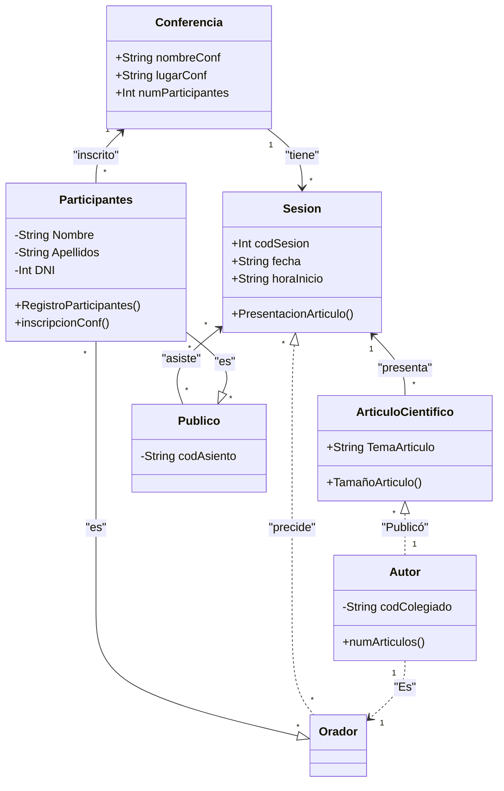

# Diagrama y código

## Diagrama de clases.

Utilizando la herramienta diagrama de Mermaid, represente mediante un diagrama de clases la gestión de un congreso científico con las siguientes consideraciones:

- La conferencia podrá tener varias sesiones.
- Una sesión tiene una fecha y hora de inicio, pertenece únicamente a una conferencia y no tiene razón de existir sin una conferencia.
- Los participantes en una sesión pueden ser oradores o audiencia. Todos ellos deben registrarse para la conferencia. Una inscripción se puede cancelar o confirmar.
- En una sesión se presentan uno o más artículos científicos. Cada artículo puede ser corto o largo y tratar sobre un tema determinado.
- Un autor puede tener uno o más artículos presentados en la conferencia.
- Coloca los atributos que te parezcan convincentes.

## Código

Escribe las clases correspondientes a tu diagrama de clases en Java. Rehaga el diseño si cree que algo no está bien.

```java


```

## Entrega
    
Elabora un documento en markdown que incluya lo siguiente:

- Breve descripción del proceso realizado:

El siguiente es un Diagrama de Clases de una conferencia cientifica, la cual tiene toda la informacion dividida en clases, ademas de tener sus intereacciones y relaciones

- Código fuente del diagrama anotado en sus etiquetas.



- Código java de las clases.
